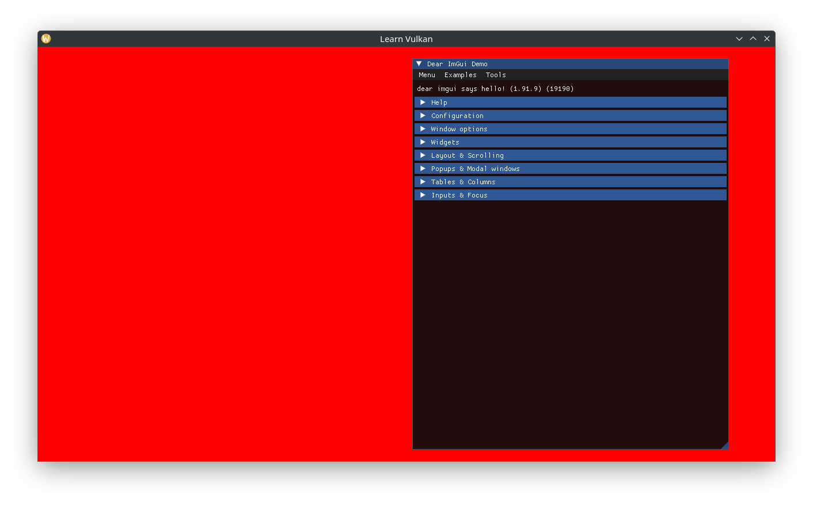

# ImGui Integration

Update `Swapchain` to expose its image format:

```cpp
[[nodiscard]] auto get_format() const -> vk::Format {
  return m_ci.imageFormat;
}
```

`class App` can now store a `std::optional<DearImGui>` member and add/call its create function:

```cpp
void App::create_imgui() {
	auto const imgui_ci = DearImGui::CreateInfo{
		.window = m_window.get(),
		.api_version = vk_version_v,
		.instance = *m_instance,
		.physical_device = m_gpu.device,
		.queue_family = m_gpu.queue_family,
		.device = *m_device,
		.queue = m_queue,
		.color_format = m_swapchain->get_format(),
		.samples = vk::SampleCountFlagBits::e1,
	};
	m_imgui.emplace(imgui_ci);
}
```

Start a new ImGui frame after resetting the render fence, and show the demo window:

```cpp
m_device->resetFences(*render_sync.drawn);
m_imgui->new_frame();

// ...
render_sync.command_buffer.beginRendering(rendering_info);
ImGui::ShowDemoWindow();
// draw stuff here.
render_sync.command_buffer.endRendering();
```

ImGui doesn't draw anything here (the actual draw command requires the Command Buffer), it's just a good customization point to use indirection at later.

We use a separate render pass for Dear ImGui, again for isolation, and to enable us to change the main render pass later, eg by adding a depth buffer attachment (`DearImGui` is setup assuming its render pass will only use a single color attachment).

```cpp
m_imgui->end_frame();
rendering_info.setColorAttachments(attachment_info)
  .setPDepthAttachment(nullptr);
render_sync.command_buffer.beginRendering(rendering_info);
m_imgui->render(render_sync.command_buffer);
render_sync.command_buffer.endRendering();
```


