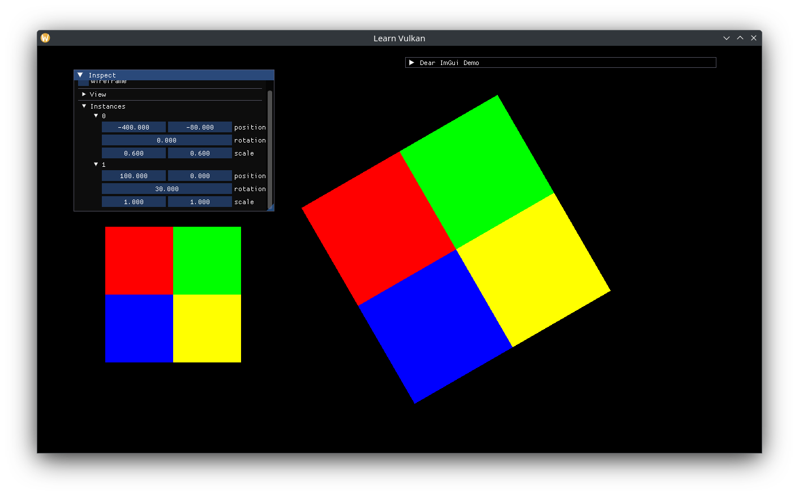

# Instanced Rendering

When multiple copies of a drawable object are desired, one option is to use instanced rendering. The basic idea is to store per-instance data in a uniform/storage buffer and index into it in the vertex shader. We shall represent one model matrix per instance, feel free to add more data like an overall tint (color) that gets multiplied to the existing output color in the fragment shader. This will be bound to a Storage Buffer (SSBO), which can be "unbounded" in the shader (size is determined during invocation).

Store the SSBO and a buffer for instance matrices:

```cpp
std::vector<glm::mat4> m_instance_data{}; // model matrices.
std::optional<ShaderBuffer> m_instance_ssbo{};
```

Add two `Transform`s as the source of rendering instances, and a function to update the matrices:

```cpp
void update_instances();

// ...
std::array<Transform, 2> m_instances{}; // generates model matrices.

// ...
void App::update_instances() {
  m_instance_data.clear();
  m_instance_data.reserve(m_instances.size());
  for (auto const& transform : m_instances) {
    m_instance_data.push_back(transform.model_matrix());
  }
  // can't use bit_cast anymore, reinterpret data as a byte array instead.
  auto const span = std::span{m_instance_data};
  void* data = span.data();
  auto const bytes =
    std::span{static_cast<std::byte const*>(data), span.size_bytes()};
  m_instance_ssbo->write_at(m_frame_index, bytes);
}
```

Update the descriptor pool to also provide storage buffers:

```cpp
// ...
vk::DescriptorPoolSize{vk::DescriptorType::eCombinedImageSampler, 2},
vk::DescriptorPoolSize{vk::DescriptorType::eStorageBuffer, 2},
```

Add set 2 and its new binding. Such a set layout keeps each "layer" isolated:

* Set 0: view / camera
* Set 1: textures / material
* Set 2: draw instances

```cpp
static constexpr auto set_2_bindings_v = std::array{
  layout_binding(1, vk::DescriptorType::eStorageBuffer),
};
auto set_layout_cis = std::array<vk::DescriptorSetLayoutCreateInfo, 3>{};
// ...
set_layout_cis[2].setBindings(set_2_bindings_v);
```

Create the instance SSBO after the view UBO:

```cpp
m_instance_ssbo.emplace(m_allocator.get(), m_gpu.queue_family,
                        vk::BufferUsageFlagBits::eStorageBuffer);
```

Call `update_instances()` after `update_view()`:

```cpp
// ...
update_view();
update_instances();
```

Extract transform inspection into a lambda and inspect each instance transform too:

```cpp
static auto const inspect_transform = [](Transform& out) {
  ImGui::DragFloat2("position", &out.position.x);
  ImGui::DragFloat("rotation", &out.rotation);
  ImGui::DragFloat2("scale", &out.scale.x, 0.1f);
};

ImGui::Separator();
if (ImGui::TreeNode("View")) {
  inspect_transform(m_view_transform);
  ImGui::TreePop();
}

ImGui::Separator();
if (ImGui::TreeNode("Instances")) {
  for (std::size_t i = 0; i < m_instances.size(); ++i) {
    auto const label = std::to_string(i);
    if (ImGui::TreeNode(label.c_str())) {
      inspect_transform(m_instances.at(i));
      ImGui::TreePop();
    }
  }
  ImGui::TreePop();
}
```

Add another descriptor write for the SSBO:

```cpp
auto writes = std::array<vk::WriteDescriptorSet, 3>{};
// ...
auto const set2 = descriptor_sets[2];
auto const instance_ssbo_info =
  m_instance_ssbo->descriptor_info_at(m_frame_index);
write.setBufferInfo(instance_ssbo_info)
  .setDescriptorType(vk::DescriptorType::eStorageBuffer)
  .setDescriptorCount(1)
  .setDstSet(set2)
  .setDstBinding(0);
writes[2] = write;
```

Finally, change the instance count in the draw call:

```cpp
auto const instances = static_cast<std::uint32_t>(m_instances.size());
// m_vbo has 6 indices.
command_buffer.drawIndexed(6, instances, 0, 0, 0);
```

Update the vertex shader to incorporate the instance model matrix:

```glsl
// ...
layout (set = 1, binding = 1) readonly buffer Instances {
  mat4 mat_ms[];
};

// ...
const mat4 mat_m = mat_ms[gl_InstanceIndex];
const vec4 world_pos = mat_m * vec4(a_pos, 0.0, 1.0);
```


