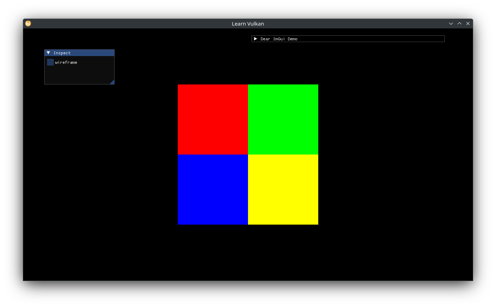

# Texture

With a large part of the complexity wrapped away in `vma`, a `Texture` is just a combination of three things:

1. Sampled Image
2. (Unique) Image View of above
3. (Unique) Sampler

In `texture.hpp`, create a default sampler:

```cpp
[[nodiscard]] constexpr auto
create_sampler_ci(vk::SamplerAddressMode const wrap, vk::Filter const filter) {
  auto ret = vk::SamplerCreateInfo{};
  ret.setAddressModeU(wrap)
    .setAddressModeV(wrap)
    .setAddressModeW(wrap)
    .setMinFilter(filter)
    .setMagFilter(filter)
    .setMaxLod(VK_LOD_CLAMP_NONE)
    .setBorderColor(vk::BorderColor::eFloatTransparentBlack)
    .setMipmapMode(vk::SamplerMipmapMode::eNearest);
  return ret;
}

constexpr auto sampler_ci_v = create_sampler_ci(
  vk::SamplerAddressMode::eClampToEdge, vk::Filter::eLinear);
```

Define the Create Info and Texture types:

```cpp
struct TextureCreateInfo {
  vk::Device device;
  VmaAllocator allocator;
  std::uint32_t queue_family;
  CommandBlock command_block;
  Bitmap bitmap;

  vk::SamplerCreateInfo sampler{sampler_ci_v};
};

class Texture {
 public:
  using CreateInfo = TextureCreateInfo;

  explicit Texture(CreateInfo create_info);

  [[nodiscard]] auto descriptor_info() const -> vk::DescriptorImageInfo;

 private:
  vma::Image m_image{};
  vk::UniqueImageView m_view{};
  vk::UniqueSampler m_sampler{};
};
```

Add a fallback bitmap constant, and the implementation:

```cpp
// 4-channels.
constexpr auto white_pixel_v = std::array{std::byte{0xff}, std::byte{0xff},
                                          std::byte{0xff}, std::byte{0xff}};
// fallback bitmap.
constexpr auto white_bitmap_v = Bitmap{
  .bytes = white_pixel_v,
  .size = {1, 1},
};

// ...
Texture::Texture(CreateInfo create_info) {
  if (create_info.bitmap.bytes.empty() || create_info.bitmap.size.x <= 0 ||
    create_info.bitmap.size.y <= 0) {
    create_info.bitmap = white_bitmap_v;
  }

  auto const image_ci = vma::ImageCreateInfo{
    .allocator = create_info.allocator,
    .queue_family = create_info.queue_family,
  };
  m_image = vma::create_sampled_image(
    image_ci, std::move(create_info.command_block), create_info.bitmap);

  auto image_view_ci = vk::ImageViewCreateInfo{};
  auto subresource_range = vk::ImageSubresourceRange{};
  subresource_range.setAspectMask(vk::ImageAspectFlagBits::eColor)
    .setLayerCount(1)
    .setLevelCount(m_image.get().levels);

  image_view_ci.setImage(m_image.get().image)
    .setViewType(vk::ImageViewType::e2D)
    .setFormat(m_image.get().format)
    .setSubresourceRange(subresource_range);
  m_view = create_info.device.createImageViewUnique(image_view_ci);

  m_sampler = create_info.device.createSamplerUnique(create_info.sampler);
}

auto Texture::descriptor_info() const -> vk::DescriptorImageInfo {
  auto ret = vk::DescriptorImageInfo{};
  ret.setImageView(*m_view)
    .setImageLayout(vk::ImageLayout::eShaderReadOnlyOptimal)
    .setSampler(*m_sampler);
  return ret;
}
```

To sample textures, `Vertex` will need a UV coordinate:

```cpp
struct Vertex {
  glm::vec2 position{};
  glm::vec3 color{1.0f};
  glm::vec2 uv{};
};

// two vertex attributes: position at 0, color at 1.
constexpr auto vertex_attributes_v = std::array{
  // the format matches the type and layout of data: vec2 => 2x 32-bit floats.
  vk::VertexInputAttributeDescription2EXT{0, 0, vk::Format::eR32G32Sfloat,
                      offsetof(Vertex, position)},
  // vec3 => 3x 32-bit floats
  vk::VertexInputAttributeDescription2EXT{1, 0, vk::Format::eR32G32B32Sfloat,
                      offsetof(Vertex, color)},
  // vec2 => 2x 32-bit floats
  vk::VertexInputAttributeDescription2EXT{2, 0, vk::Format::eR32G32Sfloat,
                      offsetof(Vertex, uv)},
};
```

Store a texture in `App` and create with the other shader resources:

```cpp
std::optional<Texture> m_texture{};

// ...
using Pixel = std::array<std::byte, 4>;
static constexpr auto rgby_pixels_v = std::array{
  Pixel{std::byte{0xff}, {}, {}, std::byte{0xff}},
  Pixel{std::byte{}, std::byte{0xff}, {}, std::byte{0xff}},
  Pixel{std::byte{}, {}, std::byte{0xff}, std::byte{0xff}},
  Pixel{std::byte{0xff}, std::byte{0xff}, {}, std::byte{0xff}},
};
static constexpr auto rgby_bytes_v =
  std::bit_cast<std::array<std::byte, sizeof(rgby_pixels_v)>>(
    rgby_pixels_v);
static constexpr auto rgby_bitmap_v = Bitmap{
  .bytes = rgby_bytes_v,
  .size = {2, 2},
};
auto texture_ci = Texture::CreateInfo{
  .device = *m_device,
  .allocator = m_allocator.get(),
  .queue_family = m_gpu.queue_family,
  .command_block = create_command_block(),
  .bitmap = rgby_bitmap_v,
};
// use Nearest filtering instead of Linear (interpolation).
texture_ci.sampler.setMagFilter(vk::Filter::eNearest);
m_texture.emplace(std::move(texture_ci));
```

Update the descriptor pool sizes to also contain Combined Image Samplers:

```cpp
/// ...
vk::DescriptorPoolSize{vk::DescriptorType::eUniformBuffer, 2},
vk::DescriptorPoolSize{vk::DescriptorType::eCombinedImageSampler, 2},
```

Set up a new descriptor set (number 1) with a combined image sampler at binding 0. This could be added to binding 1 of set 0 as well, since we are not optimizing  binding calls (eg binding set 0 only once for multiple draws):

```cpp
static constexpr auto set_1_bindings_v = std::array{
  layout_binding(0, vk::DescriptorType::eCombinedImageSampler),
};
auto set_layout_cis = std::array<vk::DescriptorSetLayoutCreateInfo, 2>{};
set_layout_cis[0].setBindings(set_0_bindings_v);
set_layout_cis[1].setBindings(set_1_bindings_v);
```

Remove the vertex colors and set the UVs for the quad. In Vulkan UV space is the same as GLFW window space: origin is at the top left, +X moves right, +Y moves down.

```cpp
static constexpr auto vertices_v = std::array{
  Vertex{.position = {-200.0f, -200.0f}, .uv = {0.0f, 1.0f}},
  Vertex{.position = {200.0f, -200.0f}, .uv = {1.0f, 1.0f}},
  Vertex{.position = {200.0f, 200.0f}, .uv = {1.0f, 0.0f}},
  Vertex{.position = {-200.0f, 200.0f}, .uv = {0.0f, 0.0f}},
};
```

Finally, update the descriptor writes:

```cpp
auto writes = std::array<vk::WriteDescriptorSet, 2>{};
// ...
auto const set1 = descriptor_sets[1];
auto const image_info = m_texture->descriptor_info();
write.setImageInfo(image_info)
  .setDescriptorType(vk::DescriptorType::eCombinedImageSampler)
  .setDescriptorCount(1)
  .setDstSet(set1)
  .setDstBinding(0);
writes[1] = write;
```

Since the Texture is not N-buffered (because it is "GPU const"), in this case the sets could also be updated once after texture creation instead of every frame.

Add the UV vertex attribute the vertex shader and pass it to the fragment shader:

```glsl
layout (location = 2) in vec2 a_uv;

// ...
layout (location = 1) out vec2 out_uv;

// ...
out_color = a_color;
out_uv = a_uv;
```

Add set 1 and the incoming UV coords to the fragment shader, combine the sampled texture color with the vertex color:

```glsl
layout (set = 1, binding = 0) uniform sampler2D tex;

// ...
layout (location = 1) in vec2 in_uv;

// ...
out_color = vec4(in_color, 1.0) * texture(tex, in_uv);
```



For generating mip-maps, follow the [sample in the Vulkan docs](https://docs.vulkan.org/samples/latest/samples/api/hpp_texture_mipmap_generation/README.html#_generating_the_mip_chain). The high-level steps are:

1. Compute mip levels based on image size
1. Create an image with the desired mip levels
1. Copy the source data to the first mip level as usual
1. Transition the first mip level to TransferSrc
1. Iterate through all the remaining mip levels:
    1. Transition the current mip level to TransferDst
    1. Record an image blit operation from previous to current mip levels
    1. Transition the current mip level to TransferSrc
1. Transition all levels (entire image) to ShaderRead
