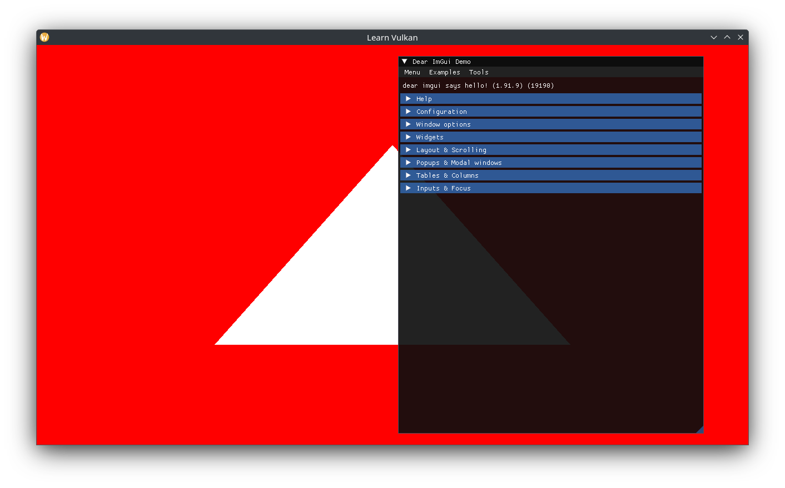
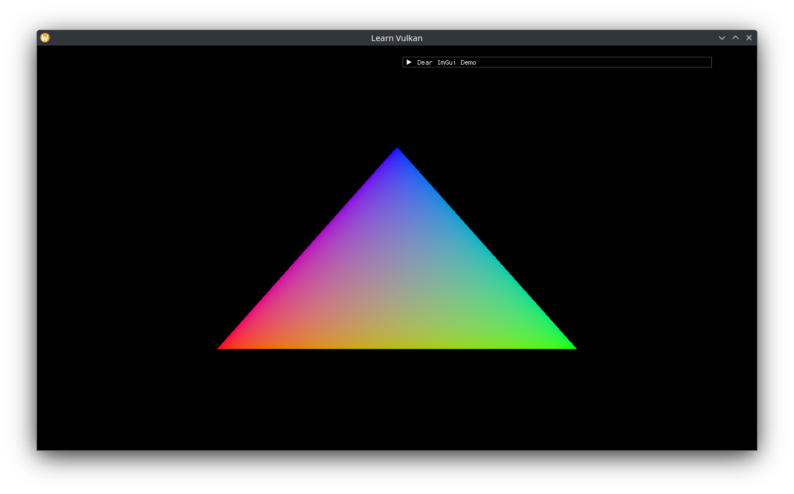

# Drawing a Triangle

We shall create two pipelines: one for standard draws, one for wireframe draws. Add new `App` members:

```cpp
void create_pipeline_builder();
void create_pipelines();

// ...
std::optional<PipelineBuilder> m_pipeline_builder{};

vk::UniquePipelineLayout m_pipeline_layout{};
struct {
  vk::UniquePipeline standard{};
  vk::UniquePipeline wireframe{};
} m_pipelines{};
float m_line_width{1.0f};
bool m_wireframe{};
```

Implement and call `create_pipeline_builder()`:

```cpp
void App::create_pipeline_builder() {
  auto const pipeline_builder_ci = PipelineBuilder::CreateInfo{
    .device = *m_device,
    .samples = vk::SampleCountFlagBits::e1,
    .color_format = m_swapchain->get_format(),
  };
  m_pipeline_builder.emplace(pipeline_builder_ci);
}
```

Complete the implementation of `create_pipelines()`:

```cpp
// ...
m_pipeline_layout = m_device->createPipelineLayoutUnique({});

auto pipeline_state = PipelineState{
  .vertex_shader = *vertex,
  .fragment_shader = *fragment,
};
m_pipelines.standard =
  m_pipeline_builder->build(*m_pipeline_layout, pipeline_state);
pipeline_state.polygon_mode = vk::PolygonMode::eLine;
m_pipelines.wireframe =
  m_pipeline_builder->build(*m_pipeline_layout, pipeline_state);
if (!m_pipelines.standard || !m_pipelines.wireframe) {
  throw std::runtime_error{"Failed to create Graphics Pipelines"};
}
```

Before `render()` grows to an unwieldy size, extract the higher level logic into two member functions:

```cpp
// ImGui code goes here.
void inspect();
// Issue draw calls here.
void draw(vk::Rect2D const& render_area,
      vk::CommandBuffer command_buffer) const;

// ...
void App::inspect() {
  ImGui::ShowDemoWindow();
  // TODO
}

// ...
command_buffer.beginRendering(rendering_info);
inspect();
draw(render_area, command_buffer);
command_buffer.endRendering();
```

We can now bind a pipeline and use it to draw the triangle in the shader. Making `draw()` `const` forces us to ensure no `App` state is changed:

```cpp
void App::draw(vk::Rect2D const& render_area,
         vk::CommandBuffer const command_buffer) const {
  command_buffer.bindPipeline(vk::PipelineBindPoint::eGraphics,
              *m_pipelines.standard);
  // we are creating pipelines with dynamic viewport and scissor states.
  // they must be set here after binding (before drawing).
  auto viewport = vk::Viewport{};
  // flip the viewport about the X-axis (negative height):
  // https://www.saschawillems.de/blog/2019/03/29/flipping-the-vulkan-viewport/
  viewport.setX(0.0f)
    .setY(static_cast<float>(m_render_target->extent.height))
    .setWidth(static_cast<float>(m_render_target->extent.width))
    .setHeight(-viewport.y);
  command_buffer.setViewport(0, viewport);
  command_buffer.setScissor(0, render_area);
  // current shader has hard-coded logic for 3 vertices.
  command_buffer.draw(3, 1, 0, 0);
}
```



Updating our shaders to use interpolated RGB on each vertex:

```glsl
// shader.vert

layout (location = 0) out vec3 out_color;

// ...
const vec3 colors[] = {
  vec3(1.0, 0.0, 0.0),
  vec3(0.0, 1.0, 0.0),
  vec3(0.0, 0.0, 1.0),
};

// ...
out_color = colors[gl_VertexIndex];

// shader.frag

layout (location = 0) in vec3 in_color;

// ...
out_color = vec4(in_color, 1.0);
```

> Make sure to recompile both the SPIR-V shaders in assets/.

And a black clear color:

```cpp
// ...
.setClearValue(vk::ClearColorValue{0.0f, 0.0f, 0.0f, 1.0f});
```

Gives us the renowned Vulkan sRGB triangle:



