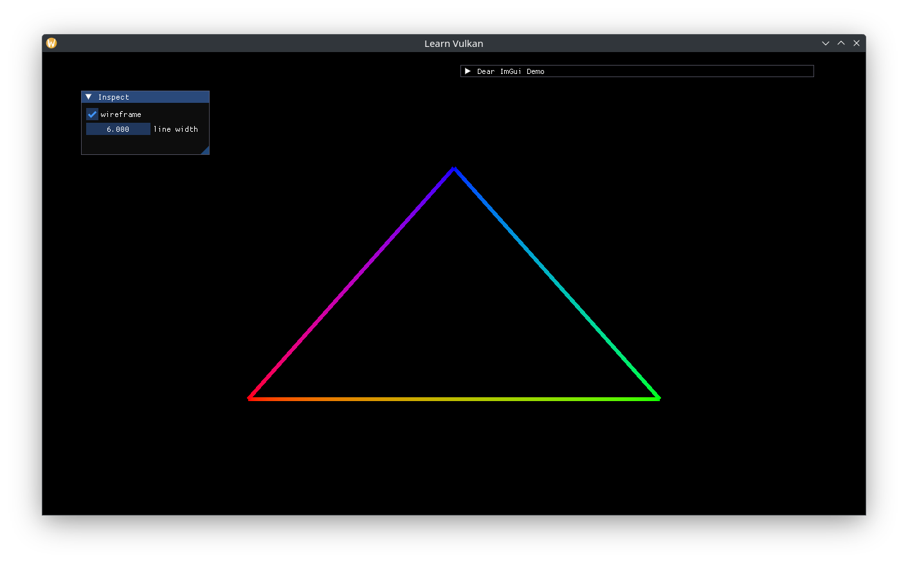

# Drawing a Triangle

Add a `ShaderProgram` to `App` and its create function:

```cpp
[[nodiscard]] auto asset_path(std::string_view uri) const -> fs::path;

// ...
void create_shader();

// ...
std::optional<ShaderProgram> m_shader{};
```

Implement and call `create_shader()` (and `asset_path()`):

```cpp
void App::create_shader() {
  auto const vertex_spirv = to_spir_v(asset_path("shader.vert"));
  auto const fragment_spirv = to_spir_v(asset_path("shader.frag"));
  auto const shader_ci = ShaderProgram::CreateInfo{
    .device = *m_device,
    .vertex_spirv = vertex_spirv,
    .fragment_spirv = fragment_spirv,
    .vertex_input = {},
    .set_layouts = {},
  };
  m_shader.emplace(shader_ci);
}

auto App::asset_path(std::string_view const uri) const -> fs::path {
  return m_assets_dir / uri;
}
```

Before `render()` grows to an unwieldy size, extract the higher level logic into two member functions:

```cpp
// ImGui code goes here.
void inspect();
// Issue draw calls here.
void draw(vk::CommandBuffer command_buffer) const;

// ...
void App::inspect() {
  ImGui::ShowDemoWindow();
  // TODO
}

// ...
command_buffer.beginRendering(rendering_info);
inspect();
draw(command_buffer);
command_buffer.endRendering();
```

We can now bind the shader and use it to draw the triangle in the shader. Making `draw()` `const` forces us to ensure no `App` state is changed:

```cpp
void App::draw(vk::CommandBuffer const command_buffer) const {
  m_shader->bind(command_buffer, m_framebuffer_size);
  // current shader has hard-coded logic for 3 vertices.
  command_buffer.draw(3, 1, 0, 0);
}
```


Updating the shaders to use interpolated RGB on each vertex:

```glsl
// shader.vert

layout (location = 0) out vec3 out_color;

// ...
const vec3 colors[] = {
  vec3(1.0, 0.0, 0.0),
  vec3(0.0, 1.0, 0.0),
  vec3(0.0, 0.0, 1.0),
};

// ...
out_color = colors[gl_VertexIndex];

// shader.frag

layout (location = 0) in vec3 in_color;

// ...
out_color = vec4(in_color, 1.0);
```

> Make sure to recompile both the SPIR-V shaders in assets/.

And a black clear color:

```cpp
// ...
.setClearValue(vk::ClearColorValue{0.0f, 0.0f, 0.0f, 1.0f});
```

Gives us the renowned Vulkan sRGB triangle:


## Modifying Dynamic State

We can use an ImGui window to inspect / tweak some pipeline state:

```cpp
ImGui::SetNextWindowSize({200.0f, 100.0f}, ImGuiCond_Once);
if (ImGui::Begin("Inspect")) {
  if (ImGui::Checkbox("wireframe", &m_wireframe)) {
    m_shader->polygon_mode =
      m_wireframe ? vk::PolygonMode::eLine : vk::PolygonMode::eFill;
  }
  if (m_wireframe) {
    auto const& line_width_range =
      m_gpu.properties.limits.lineWidthRange;
    ImGui::SetNextItemWidth(100.0f);
    ImGui::DragFloat("line width", &m_shader->line_width, 0.25f,
              line_width_range[0], line_width_range[1]);
  }
}
ImGui::End();
```



